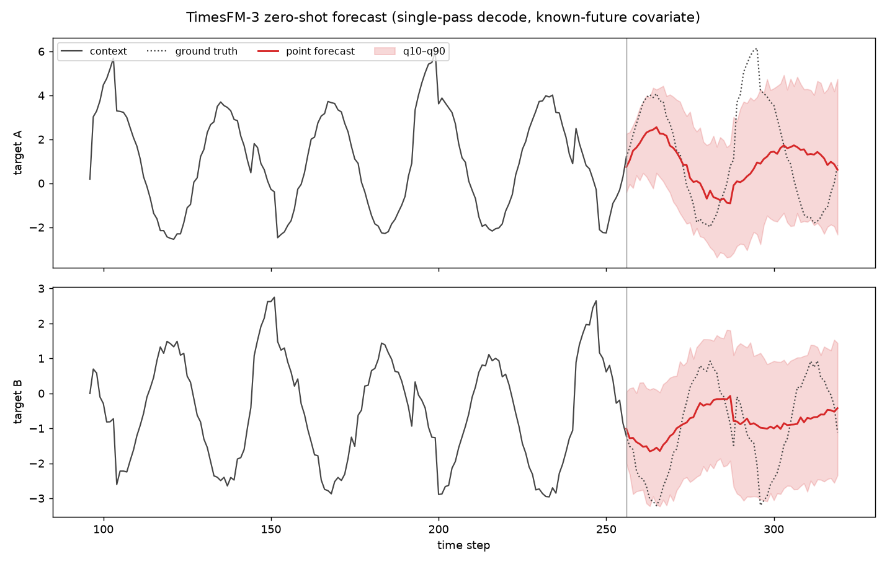

# TimesFM-3: A Zero-Shot Foundation Model for Multivariate Forecasting

A PyTorch implementation of the TimesFM-3 architecture described in the Google
Research blog post
["TimesFM-3: A zero-shot foundation model for multivariate forecasting"](https://research.google/blog/timesfm-3-a-zero-shot-foundation-model-for-multivariate-forecasting/).

TimesFM-3 is a decoder-style time-series foundation model that natively
supports:

- **Multiple simultaneous target series** with point and quantile forecasts.
- **Past-only covariates** (historical features whose future is unknown).
- **Past–future covariates** (signals known ahead of time, e.g. holidays,
  scheduled promotions, weather forecasts).
- **Single-forward-pass horizon decoding** — no autoregressive roll-out.

## Architecture (as implemented here)

| Component | Blog description | Where |
|---|---|---|
| Patching | Contiguous points grouped into patches of **32 time steps** | `timesfm3/embedding.py` |
| Normalization | Per-time-series (reversible) normalization from context statistics | `timesfm3/normalization.py` |
| Token construction | Standard series: one token per patch. Future-known covariates: **lookahead** — the current patch is concatenated with future patches so the model can peek at upcoming known signals | `timesfm3/embedding.py` |
| Alternating attention | A 2D grid of tokens (series × time). **Temporal attention** is strictly causal within each series; **cross-variate attention** lets a token attend to every other series at the same time step | `timesfm3/attention.py`, `timesfm3/blocks.py` |
| Decoding | **Contiguous Patch Masking**: target and past-only covariate patches are masked over the horizon while past–future covariates remain visible, and the whole horizon is produced in one forward pass. Horizons beyond the single-pass maximum roll forward chunk by chunk | `timesfm3/model.py`, `timesfm3/forecaster.py` |
| Output | **9 quantiles (q10 … q90, median at index 4)** plus a point forecast for every target at every horizon step, with optional quantile-crossing repair | `timesfm3/model.py`, `timesfm3/forecaster.py` |
| Scale | Base config matches the released TimesFM-3 dimensions — 20 layers, model dim 1280, 16 heads — at ~334 M parameters (`small` and `tiny` configs included for experimentation) | `timesfm3/configuration.py` |

## Layout

```
timesfm3/
  configuration.py   # model / training hyper-parameters (base ≈ 330M params)
  normalization.py   # per-series reversible normalization (context statistics)
  embedding.py       # patching, residual-MLP patch embedding, lookahead tokens
  attention.py       # multi-head attention with rotary embeddings (temporal)
  blocks.py          # alternating temporal / cross-variate transformer layers
  model.py           # TimesFM3Model: contiguous patch masking + quantile head
  forecaster.py      # high-level numpy-in / numpy-out zero-shot forecast API
  loss.py            # quantile (pinball) + point losses
  data/synthetic.py  # synthetic multivariate pre-training corpus generator
  train.py           # pre-training loop (real + synthetic corpus)
examples/
  forecast_example.py
```

## Quick start

```bash
pip install -e .
python examples/forecast_example.py
```

```python
import numpy as np
from timesfm3 import TimesFM3Config, TimesFM3Forecaster

forecaster = TimesFM3Forecaster(TimesFM3Config.small())  # or .base() for ~334M
# ... or load weights you trained: TimesFM3Forecaster.from_checkpoint("ckpt.pt")

result = forecaster.forecast(
    targets=[np.sin(np.arange(512) / 10.0)],       # one or more target series
    past_covariates=[np.random.randn(512)],        # optional, history only
    future_covariates=[np.random.randn(512 + 128)],# optional, known over horizon
    horizon=128,
)
result.point      # (num_targets, horizon) point forecast
result.quantiles  # (num_targets, horizon, 9) q10 ... q90
```

## Pre-training

The released model was pre-trained on a real-world plus synthetic corpus of
more than 1 trillion time points. This repo ships the training objective
(quantile + point loss under contiguous patch masking) and a synthetic
multivariate corpus generator so the pipeline is runnable end to end:

```bash
python -m timesfm3.train --config tiny --steps 600 --batch-size 16 \
    --context-patches 8 --horizon-patches 2
python examples/plot_forecast.py --checkpoint timesfm3_checkpoint.pt
```

The tiny (1M parameter) config trains in ~20 minutes on CPU and already
produces calibrated seasonal forecasts on held-out synthetic series. After
4000 steps it reaches a scaled MAE of **0.80** on 249 held-out target
series, versus **1.27** for a last-value baseline and **1.06** for a
context-mean baseline (`examples/evaluate.py`):



The plot (`examples/plot_forecast.py`) shows the single-pass decode on two
correlated targets with a known-future covariate: the point forecast
continues the seasonal phase and the q10–q90 band widens with lead time.

This is an independent re-implementation of the publicly described
architecture; no pre-trained weights are included, and the released
TimesFM-3 checkpoint (which carries its own non-commercial license) is a
separate artifact from this code.
